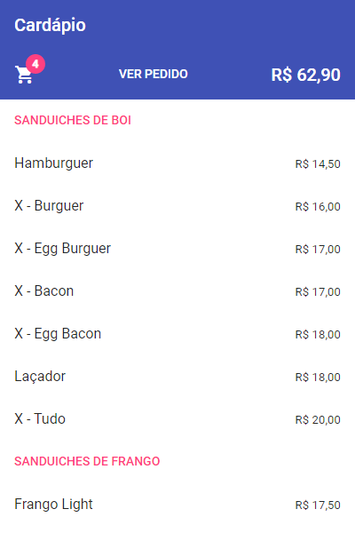
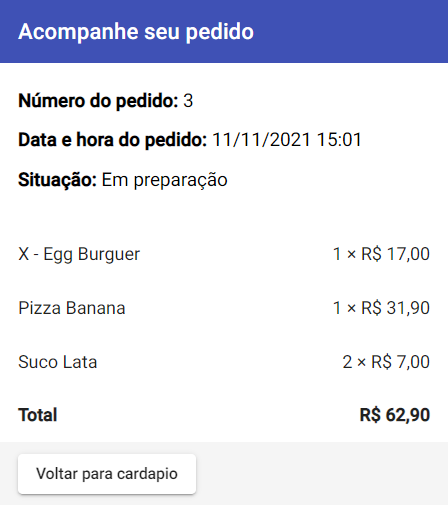
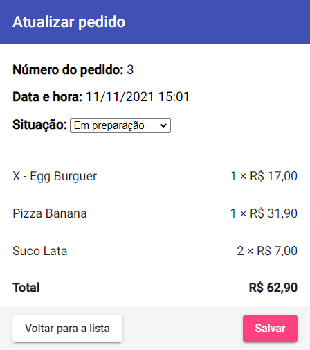

# 🧠 Desafio Final

Módulo final do [**Bootcamp Desenvolvedor Tech PAN**](../../../).

Consiste em um aplicativo *full stack* que simula um serviço de pedido de comida. O *front-end* foi desenvolvido com Angular e o *back-end* em Java com Spring Boot. Ambas as partes foram desenvolvidas do zero, apenas utilizando o *schema* (com pequenas alterações) do banco de dados e o *script* com os dados iniciais dos produtos, que foram providenciados pelo professor.

### 🏗️ Implementações

- [*Back-end*](backend/)
- *Front-end* [🚧 **WIP** 🚧]

## 👨‍🏫 Enunciado

>### Objetivos
>
>Exercitar os seguintes conceitos trabalhados no Curso:
>
>- Desenvolvimento *front end* usando o *framework* Angular.
>- Desenvolvimento *back end* usando Spring Boot.
>
>### Enunciado
>
>Construa uma aplicação completa (*full stack*) para pedido de refeições, utilizando Angular no *frontend* e Spring Boot no *backend*. Tal aplicação é composta por cinco telas, conforme detalhado a seguir.
>
><table style="width: 100%;">
>    <colgroup>
>        <col span="1" style="width: 70%;">
>    </colgroup>
>    <tbody>
>        <tr>
>            <td>
>                

>                    A tela inicial, <strong>Cardápio</strong>, exibe a lista de produtos e seus respectivos preços. Ao clicar em um produto, ele deve ser adicionado ao pedido atual. Um produto pode ser adicionado repetidas vezes ao pedido, aumentando a quantidade do mesmo. Esta tela também deve:
>                

>                <ul>
>                    <li>
>                        Mostrar a quantidade de itens adicionados e o valor total do pedido atual.
>                    </li>
>                    <li>
>                        Ter um link para a tela Pedido.
>                    </li>
>                </ul>
>            </td>
>            <td>
>                
>            </td>
>        </tr>
>        <tr>
>            <td>
>                

>                    A tela <strong>Pedido</strong> exibe cada produto adicionado ao pedido atual e a respectiva quantidade, bem como o valor total do pedido. Esta tela possibilita:
>                

>                <ul>
>                    <li>
>                        Voltar para a tela <strong>Cardápio</strong>.
>                    </li>
>                    <li>
>                        Limpar o pedido (excluir todos os produtos).
>                    </li>
>                    <li>
>                        Concluir o pedido (realiza o pedido e navega para a tela <strong>Acompanhe seu pedido</strong>)
>                    </li>
>                </ul>
>            </td>
>            <td>
>                
>            </td>
>        </tr>
>        <tr>
>            <td>
>                

>                    A tela <strong>Acompanhe seu pedido</strong> mostra o número do pedido (gerado pelo <em>backend</em>), a data/hora na qual ele foi realizado e sua situação. A tela deve atualizar os dados automaticamente de 5 em 5 segundos, para refletir qualquer mudança na situação do pedido.
>                

>            </td>
>            <td>
>                
>            </td>
>        </tr>
>        <tr>
>            <td>
>                

>                    A tela <strong>Gerenciar pedidos</strong> exibe a lista de todos os pedidos realizados (para que o restaurante possa atendê-los). Ao clicar em um pedido, a aplicação navega para a tela <strong>Atualizar Pedido</strong>.
>                

>            </td>
>            <td>
>                
>            </td>
>        </tr>
>        <tr>
>            <td>
>                

>                    A tela <strong>Atualizar Pedido</strong> permite alterar a situação do mesmo. As possíveis situações são: <em>Aguardando</em>, <em>Em preparação</em>, <em>Saiu para entrega</em> e <em>Entregue</em>. Após Salvar, a aplicação navega para a tela <strong>Gerenciar pedidos</strong>.
>                

>            </td>
>            <td>
>                
>            </td>
>        </tr>
>    </tbody>
></table>
>
>O projeto deve ser desenvolvido a partir de um código-fonte base disponibilizado no **Fórum de avisos do professor**. Neste código-fonte, as telas **Cardápio** e **Pedido** já estarão implementadas, assim como a modelagem e configuração do banco de dados.
>
>O *frontend* da aplicação deve usar o sistema de roteamento do Angular para exibir cada tela, defina as rotas como achar necessário.
>
>O *backend* da aplicação deve ler/armazenar dados em um banco de dados, disponibilizando *endpoints* para:
>
>- Listar os produtos (**GET /cardapio**)
>- Realizar um pedido (**POST /pedidos**)
>- Obter detalhes de um pedido (**GET /pedidos/{idPedido}**)
>- Listar todos os pedidos (**GET /pedidos**)
>- Atualizar a situação de um pedido (**PUT /pedidos/{idPedido}**)
>
>Defina os detalhes necessários para implementar cada endpoint (dados recebidos como parâmetro, corpo, dados de resposta etc.). Para simplificar, não se preocupe com usuários ou autenticação.
>
>### Atividades
>
>Os alunos deverão desempenhar as seguintes atividades:
>
>1. Baixe o código-fonte base, disponibilizado no **Fórum de avisos do professor**, e execute o *backend* e *frontend*. Verifique o funcionamento do sistema.
>2. Implemente o *endpoint* de realizar um pedido e a tela **Acompanhe seu pedido**, bem como o *endpoint* de obter detalhes de um pedido.
>3. Implemente a tela **Gerenciar pedidos** e o *endpoint* necessário.
>4. Implemente a tela **Atualizar Pedido** e o *endpoint* necessário.
>5. Verifique se toda a aplicação funciona e se a tela **Acompanhe seu pedido** é atualizada de acordo com as mudanças na situação.