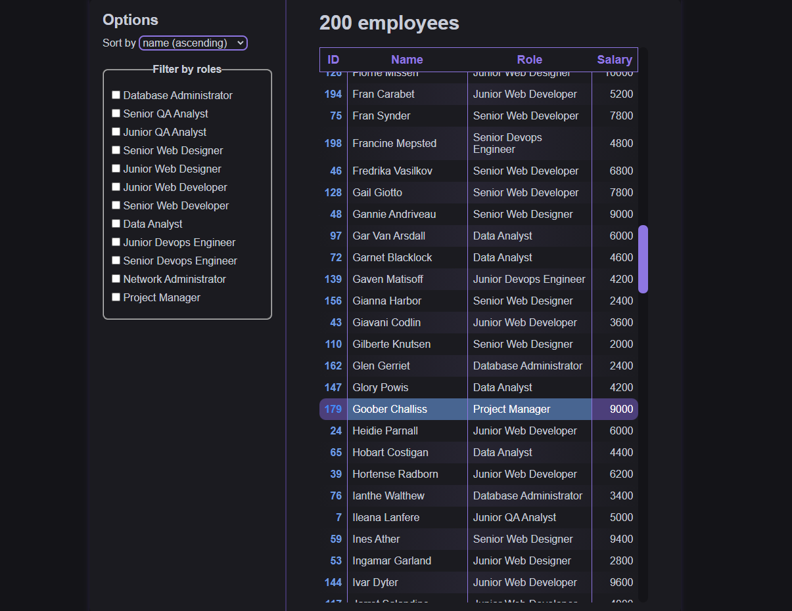
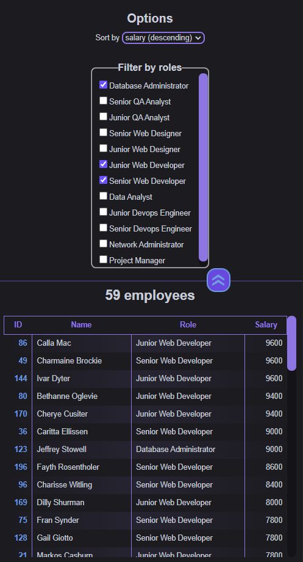
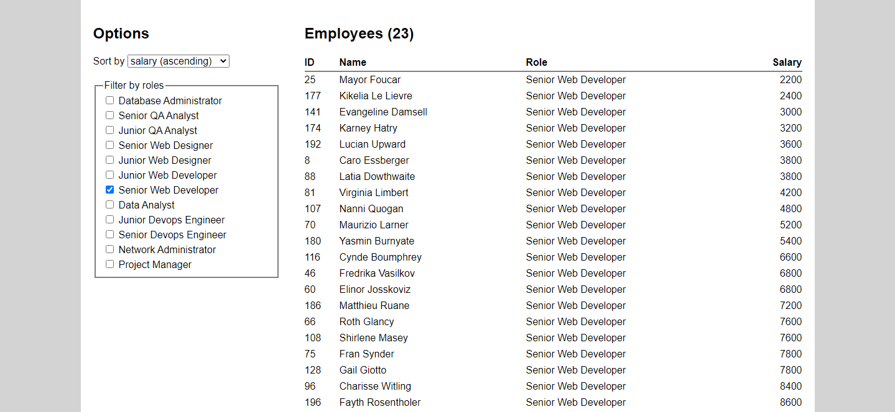

## 📃 Sobre

Desafio do **[Módulo 1: Fundamentos de Front-End](../)**.

Consiste em uma página web que exibe uma tabela rolável de funcionários fictícios com opções de filtragem e ordenação, além de informar o número atual de funcionários exibidos na tabela. As informações utilizadas são obtidas de *endpoints* providos por um [back-end local](backend/).

Também foi implementado responsividade para dispositivos com larguras estreitas, apresentando o menu de opções acima da tabela de forma expansível/retrátil.

### 🗃️ Executando o Back-End

Acesse o diretório `backend` dentro do prompt de comando e execute os seguintes comandos (requer o [Node.js](https://nodejs.org/en/download/) instalado):

1. `npm install`
2. `npm start`

O back-end local será provido na porta 3000 (https://localhost:3000).

##  👨‍🏫 Enunciado

> ### Objetivos
>
> Exercitar os seguintes conceitos trabalhados no Módulo:
>
> - Programação em JavaScript
> - Interação com o DOM
> - Manipulação de arrays
> - Requisições HTTP
> - Estilização com CSS
>
> ### Enunciado
>
> Construa, utilizando HTML, CSS e JavaScript, uma página de listagem de registros, com ordenação e filtros configuráveis, utilizando o Back End fornecido junto com o código fonte das aulas.
>
> ### Atividades
>
> Os alunos deverão desempenhar as seguintes atividades:
> 1. Crie uma página para sua aplicação e utilize *fetch* para buscar os dados dos dois *endpoints* disponibilizados: `/employees` e `/roles` (não se esqueça de executar o comando `npm install` antes de iniciar o Back End pela primeira vez).
>
> 2. Exiba a lista `employees` em uma tabela, contendo as seguintes colunas:
>
>    - ID (campo `id`);
>    - Name (campo `name`);
>    - Role (campo `name` da *role* correspondente ao campo `role_id`);
>    - Salary (campo `salary`).
>
> 3. Inclua na aplicação um elemento *select* que permita escolher um critério de ordenação. Os dados devem ser inicialmente ordenados alfabeticamente pelo Nome. Sempre que o valor do *select* mudar, eles devem ser reordenados usando JavaScript (não busque dados do Back End). As opções de ordenação são:
>
>    - Nome ascendente (valor padrão).
>    - Nome descendente.
>    - Salário ascendente.
>    - Salário descendente.
>
> 4. Inclua também na aplicação a opção de filtrar os registros pela coluna Role. Para cada objeto obtido em `/roles`, inclua um *checkbox* correspondente. Ao marcar um ou mais *checkboxes*, a tabela deve exibir apenas *employees* com qualquer uma das *roles* selecionadas. Por exemplo, se estão marcados Data Analyst e Project Manager, exiba apenas *employees* com role Data Analyst __OU__ Project Manager. Se não houver nenhuma *role* marcada, exiba todos os registros. A filtragem também deve ser feita via JavaScript (sem buscar dados do Back End).
>
> 5. Exiba na interface da aplicação a quantidade de registros exibidos no momento, para facilitar a contagem.
>
> 6. Estilize a interface como desejado, mas cumprindo duas exigências:
>
>    - As opções de ordenação e filtros devem ficar ao lado da tabela de dados, à esquerda dela.
>
>    - A coluna Salary deve ter seu conteúdo alinhado à direita.
>
> Exemplo de interface:
>
> 