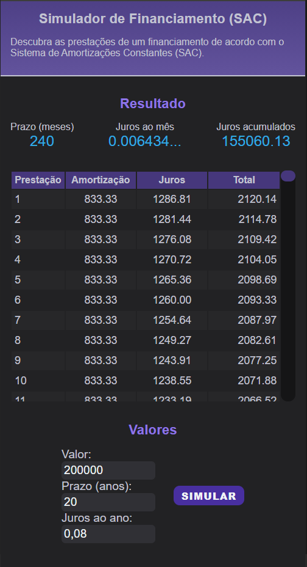
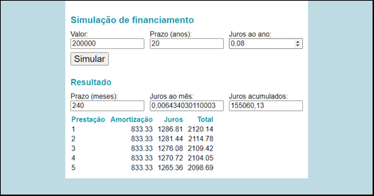

## 📃 Sobre

Trabalho Prático do **[Módulo 1: Fundamentos de Front-End](../)**.

Consiste em uma página web que simula um financiamento de acordo com o Sistema de Amortizações Constantes (SAC), utilizando HTML, CSS e JavaScript.

Apresenta uma tabela rolável contendo todas as prestações, ao invés de uma tabela com apenas as cinco primeiras prestações como pedido na especificação do trabalho.

##  👨‍🏫 Enunciado

> ### Objetivos
>
> Exercitar os seguintes conceitos trabalhados no Módulo:
>
> - Documentos HTML.
> - Estilização com CSS.
> - Programação em JavaScript.
> - Reagir a eventos e alterar o DOM.
>
> ### Enunciado
>
> Construa, utilizando HTML, CSS e JavaScript, uma página para simulação de um financiamento com base nos dados fornecidos, exibindo o valor das primeiras prestações, de acordo com o Sistema de Amortizações Constantes (SAC).
> 
> ### Atividades
>
> Os alunos deverão desempenhar as seguintes atividades:
>
> 1. Crie uma página com três campos de entrada numéricos: Valor, Prazo (anos) e Juros ao ano. Tais campos devem estar inicialmente preenchidos com os valores 200.000, 20 e 0,08, respectivamente.
>
> 2. Adicione um botão Simular. Ao apertar o botão, calcule e exiba na interface as seguintes informações: prazo (meses), juros ao mês, juros acumulados e tabela com o valor das 5 primeiras prestações, indicando o valor pago como amortização, o valor como juros e o total (soma dos dois).
>
> 3. O cálculo da parcela deve ser feito de acordo com o Sistema de Amortizações Constantes (SAC).
>
> 4. Para simplificar, assuma que os campos de entrada sempre estarão preenchidos corretamente. Ou seja, não é obrigatório tratar o caso do valor, prazo ou juros ao ano estarem vazios ou com valores inválidos.
>
> 5. Estilize a aplicação usando CSS da maneira que achar adequado. A única exigência é utilizar cor de texto diferente para destacar um ou mais elementos. A imagem é um exemplo de possível interface, apenas como inspiração:
>
> 