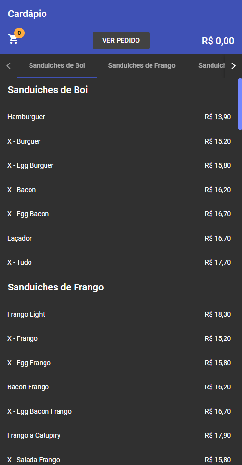
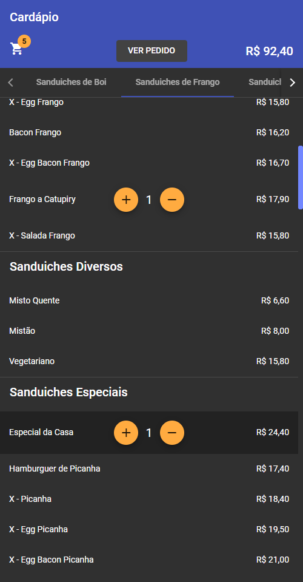
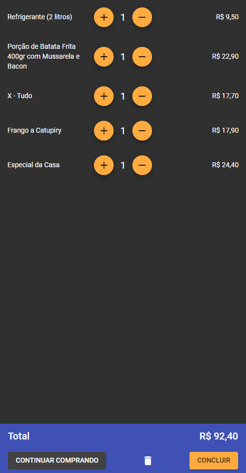
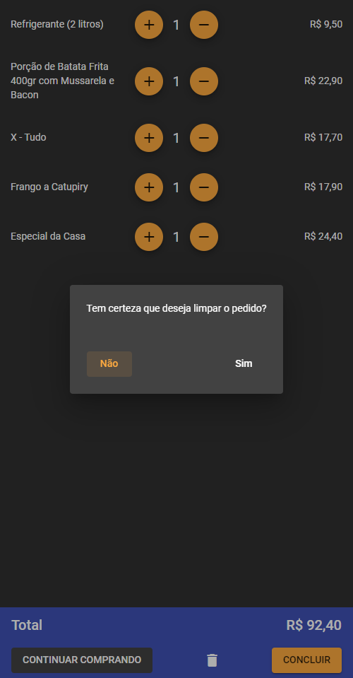
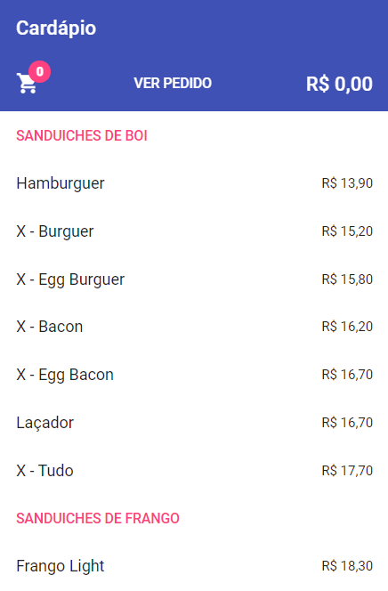
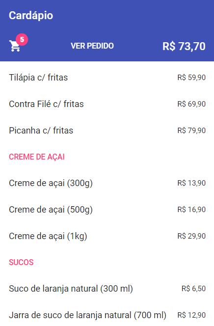
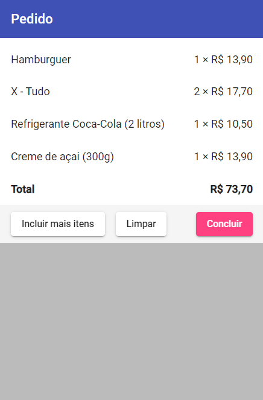

## Índice de conteúdo

1. [Sobre](#-sobre)
   1. [Angular Material](#-angular-material)
   2. [Roteamento](#%EF%B8%8F-roteamento)
   3. [Componentes](#-componentes)
   4. [Interfaces](#-interfaces)
   5. [Serviço](#-serviço)
   6. [Guias de navegação dinâmica](#-guias-de-navegação-dinâmica)
   7. [Servidor de desenvolvimento](#-servidor-de-desenvolvimento)
2. [Enunciado](#-enunciado)

## 📃 Sobre

Desafio do [**Módulo 2: Angular**](../).

Consiste em uma simulação de aplicativo de pedido de comida. Contém duas telas roteadas; uma que exibe o cardápio e outra que exibe o pedido. Para a parte visual, foram utilizados dez módulos da biblioteca [Angular Material](https://material.angular.io/). Também foram gerados sete componentes, um serviço e duas interfaces para implementar as funcionalidades requisitadas pelo desafio — além de algumas extras, como guias dinâmicas de navegação e exibição de uma janela modal de confirmação.

<table>
    <tbody align="center">
        <tr>
            <td>
                
            </td>
            <td>
                
            </td>
        </tr>
        <tr>
            <td>
                <em>Tela <strong>Cardápio</strong></em> 
            </td>
            <td>
                <em>Tela <strong>Cardápio</strong> após adicionar produtos</em>
            </td>
        </tr>
        <tr>
            <td>
                
            </td>
            <td>
                
            </td>
        </tr>
        <tr>
            <td>
                <em>Tela <strong>Pedido</strong></em>
            </td>
            <td>
                <em>Tela <strong>Pedido</strong> exibindo confirmação de limpeza</em>
            </td>
        </tr>
        <tr>
            <td colspan="2">
                
            </td>
        </tr>
        <tr>
            <td colspan="2">
                <em>Tela <strong>Pedido</strong> após limpar</em>
            </td>
        </tr>
    </tbody>
</table>

O projeto foi gerado com a [Angular CLI](https://github.com/angular/angular-cli) versão 11.2.7.

### 🎨 Angular Material

Para atender a proposta do desafio e melhorar a interface do aplicativo, foram importados dez módulos da biblioteca Angular Material:

- **[Badge](https://material.angular.io/components/badge/overview)**, para exibir o número de itens no carrinho;
- **[Button](https://material.angular.io/components/button/overview)**, para estilização de botões/âncoras;
- **[Dialog](https://material.angular.io/components/dialog/overview)**, para exibir uma janela modal de confirmação;
- **[Divider](https://material.angular.io/components/divider/overview)**, para dividir as categorias do cardápio;
- **[Icon](https://material.angular.io/components/icon/overview)**, para a utilização dos ícones `shopping_cart`, `add`, `remove` e `delete`;
- **[List](https://material.angular.io/components/list/overview)**, para listar as diferentes categorias de produtos;
- **[Progress spiner](https://material.angular.io/components/progress-spinner/overview)**, para ser exibido enquanto o cardápio carrega os produtos;
- **[Tabs](https://material.angular.io/components/tabs/overview)**, para, em conjunto com a [API Intersection Observer](https://developer.mozilla.org/en-US/docs/Web/API/Intersection_Observer_API), exibir um conjunto dinâmico de guias de navegação por categoria;
- **[Toolbar](https://material.angular.io/components/toolbar/overview)**, para servir de cabeçalho da tela de cardápio e rodapé da tela de pedido;
- **[Tooltip](https://material.angular.io/components/tooltip/overview)**, para exibir uma dica do que um botão faz;

### ✈️ Roteamento

Foram definidas duas rotas e um redirecionamento:

- `/cardapio`, para o componente `cardapio`;

  ```typescript
  {path: 'cardapio', component: CardapioComponent}
  ```

- `/pedido`, para o componente `pedido`;

  ```typescript
  {path: 'pedido', component: PedidoComponent}
  ```

- redirecionamento da raíz para a rota `/cardapio`;

  ```typescript
  {path: '', pathMatch: 'full', redirectTo: 'cardapio'}
  ```

As rotas são acessadas através de botões/âncoras presentes dentro dos componentes.

```html
<!--> Botão presente na tela de cardápio </-->
<a mat-flat-button routerLink="/pedido">VER PEDIDO</a>

<!--> Botão presente na tela de pedido </-->
<a mat-flat-button routerLink="/cardapio">CONTINUAR COMPRANDO</a>
```

### 🧩 Componentes

Para exercitar o conceito de componentização/modularidade, foram criados sete componentes:

- **CardapioComponent** — `selector: 'cardapio'`, para exibir a tela principal contendo o cardápio;
- **SumarioComponent** — `selector: 'sumario'`, para exibir um resumo do pedido;
- **PedidoComponent** — `selector: 'pedido'`, para exibir a tela contendo os detalhes do pedido;
- **ConfirmComponent** — `selector: 'confirm'`, para ser exibido dentro de uma janela modal de confirmação utilizando o serviço **MatDialog**, do Angular Material;
- **CategoriaComponent** — `selector: 'categoria'`, para exibir os produtos separados por categoria;
- **ItemComponent** — `selector: 'item'`, para a exibição de um produto individual;
- **ContadorComponent** — `selector: 'contador'`, para exibir a contagem de quantas unidades do produto foram adicionadas ao pedido, junto com botões para incremento e decremento do mesmo;

<table style="table-layout: fixed;">
    <thead align="center">
        <tr>
            <th colspan="4">Hierarquia de componentes</th>
        </tr>
    </thead>
    <tbody align="center">
        <tr>
            <td colspan="4">
                <code>root</code>
            </td>
        </tr>
        <tr>
            <td colspan="2">
                <code>cardapio</code><sup>1</sup>
            </td>
            <td colspan="2">
                <code>pedido</code><sup>1</sup>
            </td>
        </tr>
        <tr>
            <td>
                <code>sumario</code><sup>1</sup>
            </td>
            <td>
                <code>categoria</code><sup>*</sup>
            </td>
            <td colspan="2">
                <code>item</code><sup>*</sup>
            </td>
        </tr>
        <tr>
            <td style="visibility: collapse"></td>
            <td>
                <code>item</code><sup>*</sup>
            </td>
            <td colspan="2">
                <code>contador</code><sup>1</sup>
            </td>
        </tr>
        <tr>
            <td style="visibility: collapse"></td>
            <td>
                <code>contador</code><sup>1</sup>
            </td>
        </tr>
	</tbody>
</table>


*\*: componentes gerados iterativamente, sem quantidade fixa.*

### 📐 Interfaces

Foram definidas duas interfaces:

- `Produto`, com os campos `categoria: string`, `descricao: string` e `preco: number`;
- `Pedido`, com os campos `precoTotal: number`,  `quantidade: number` e `produto: Produto`;

A interface `Produto` é utilizada dentro de diversos componentes que necessitam lidar com dados de produtos. Já a interface `Pedido` é utilizada dentro do serviço `PedidoService` para gerenciar os pedidos que foram feitos.

### 🌐 Serviço

Para gerenciamento, distribuição e captura de dados de forma global na aplicação, foi criado um serviço chamado `PedidoService`. Esse serviço é disponibilizado na `root` do projeto e injetado nos componentes `CardapioComponent`, `ContadorComponent`, `ItemComponent`, `PedidoComponent` e `SumarioComponent`.

Ele provê métodos para adicionar ou remover um produto do pedido, obter a quantidade de unidades de um produto no pedido e limpar o pedido. Ele também possui propriedades para gerenciar o estado global do pedido através de um vetor com todos os produtos obtidos, a quantidade total de produtos que foi adicionada ao pedido e o preço total do pedido. Também há um `Observable` do tipo `Produto[]`, com valor obtido pelo método `get<Produto[]>()` do serviço injetado `HttpClient`. Esse `Observable` provê a lista de produtos obtida do *endpoint* do *back-end* local (http://localhost:3000/cardapio) e pode ser utilizado pelos componentes através do método `subscribe()`.

### 📑 Guias de navegação dinâmica


Para a criação de um conjunto de guias de navegação dinâmica — isso é, guias de navegação por categoria/seção que se atualizam automaticamente a partir da posição de certos elementos no *viewport* — foi utilizado o componente [Tabs](https://material.angular.io/components/tabs/overview), do Angular Material, em conjunto com a [API Intersection Observer](https://developer.mozilla.org/en-US/docs/Web/API/Intersection_Observer_API). A instância de `IntersectionObserver` foi utilizada dentro do componente `cardapio`, e os elementos alvo da observação (método `observe()`) são os componentes do tipo `categoria`.

E, para implementar a rolagem da *scrollbar* até a categoria clicada sem a utilização de `id`s, foi utilizado o método `scrollTo()` em uma `div` com posição relativa que embrulha os elementos `categoria`. Para obter a coordenada Y para que se deve rolar para exibir o elemento alvo, se obtém a propriedade `offsetTop` desse mesmo elemento.

Há um controle de indíces de `categoria`s no componente `cardapio` que facilita tanto a rolagem ao clicar nas guias quanto a atualização dinâmica da guia ativa.

###  🏭 Servidor de desenvolvimento

Antes de executar o servidor de desenvolvimento do Angular, dentro do diretório `/backend`, execute o seguinte comando (necessário ter o [json-server](https://www.npmjs.com/package/json-server#getting-started)):

```bash
json-server --watch cardapio.json
```

Isso irá rodar o back-end local na [porta 3000](http://localhost:3000/cardapio). Após isso, dentro da raíz do projeto, execute:

```bash
ng serve
```

A aplicação será servida automaticamente na [porta 4200](http://localhost:4200). Caso deseje que uma página seja aberta no navegador automaticamente assim que o servidor de desenvolvimento estiver disponível, basta, ao invés de executar o comando anterior, executar:

```bash
ng serve --open
```

A página atualizará automaticamente assim que qualquer alteração no código fonte for detectada.

## 👨‍🏫 Enunciado

> ### Objetivos
>
> Exercitar os seguintes conceitos trabalhados no Módulo:
>
> - Criar componentes, templates e pipes.
> - Comunicar com o back end.
> - Definir roteamento.
> - Usar serviços.
> - Usar a biblioteca Angular Material.
>
> ### Enunciado
>
> Construa, utilizando Angular, uma aplicação para pedido de comida, que vamos chamar de *ngFood*. Tal aplicação deve ter duas telas (cada uma com sua rota).
> A tela inicial, **Cardápio**, exibe a lista de produtos e seus respectivos preços. Ao clicar em um produto, ele deve ser adicionado ao pedido atual. Um produto pode ser adicionado repetidas vezes ao pedido, aumentando a quantidade do mesmo. Esta tela também deve:
>
> - Mostrar a quantidade de itens adicionados e o valor total do pedido atual.
> - Ter um link para a tela **Pedido**.
> - Exibir a categoria acima do produto quando ele não for da mesma categoria do anterior na lista (produtos da mesma categoria estão em sequência).
>
> A tela **Pedido** exibe cada produto adicionado ao pedido atual e a respectiva quantidade, bem como o valor total do pedido. Esta tela deve ter botões para:
>
> - Voltar para a tela **Cardápio**.
> - Limpar o pedido (excluir todos os produtos).
> - Concluir o pedido (não faz nada, apenas exiba o botão).
>
> |  |  |
> | :----------------------------------------------------------: | :----------------------------------------------------------: |
> |                     *Tela **Cardápio***                      |         *Tela **Cardápio** após adicionar produtos*          |
> |  |  |
> |                      *Tela **Pedido***                       |                *Tela **Pedido** após limpar*                 |
>
> Acima temos exemplos da interface da aplicação em diferentes situações. Sua aplicação não precisa ter exatamente a mesma aparência do exemplo dado, basta ter o comportamento especificado.
>
> No entanto, você deve cumprir às seguintes exigências:
>
> - A lista de produtos deve ser obtida por meio de uma requisição HTTP a um *back end* fictício, baseado em *json-server*. Execute-o por meio do comando `json-server --watch cardapio.json`. O arquivo `cardapio.json` será fornecido pelo professor no fórum de avisos. Note que o *endpoint* `/cardapio` retorna um *array* onde cada objeto possui os campos `categoria`, `descricao` e `preco`.
>   • Use ao menos um componente da biblioteca Angular Material.
>   • Use um serviço para armazenar e gerenciar os dados do pedido atual (que são globais).
>
> ### Atividades
>
> Os alunos deverão desempenhar as seguintes atividades:
>
> 1. Crie o projeto e adicione a dependência para Angular Material.
> 2. Configure o módulo principal da aplicação, adicionando *imports* para os módulos necessários, como HttpClientModule, módulos do Angular Material etc.
> 3. Crie os componentes para as duas telas.
> 4. Configure rotas para cada tela.
> 5. Implemente o carregamento de dados (lembre-se de executar o *back end*).
> 6. Implemente as funcionalidades descritas.