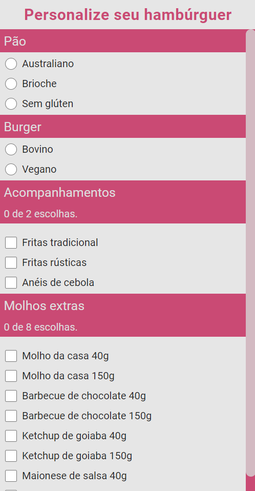
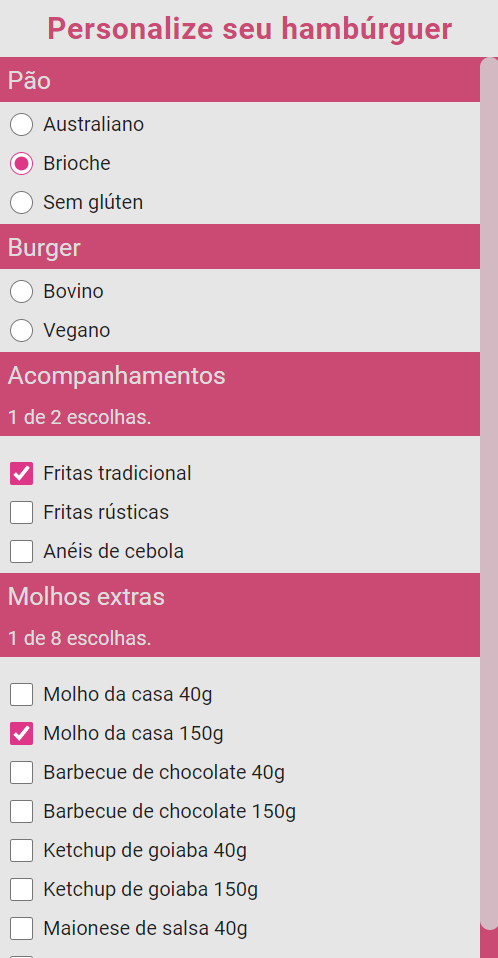
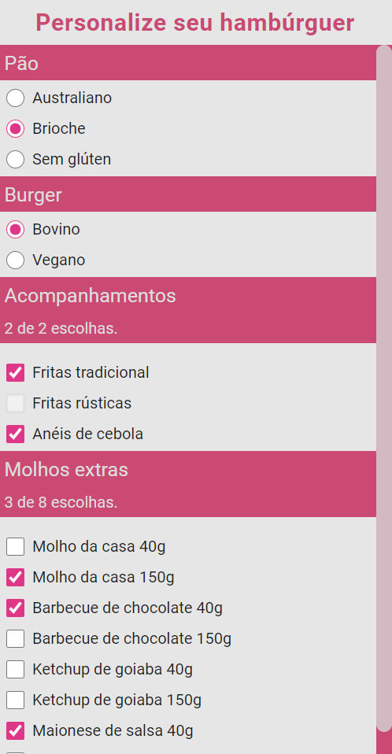
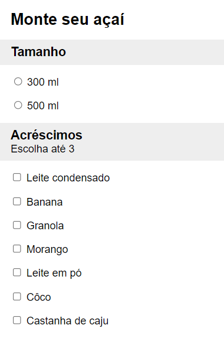
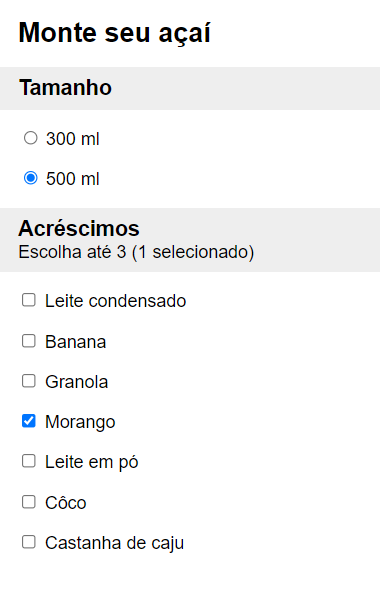
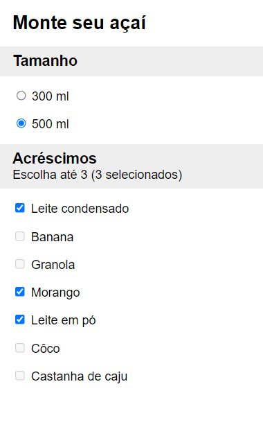

# 📃 Sobre

Trabalho Prático do [**Módulo 2: Angular**](../).

Consiste em uma página que simula um aplicativo de venda de hambúrguer. Apresenta um menu com opções de escolha de pão, burger, acompanhamentos e molhos extras, limitando as escolhas ao número apropriado.
|[](../../image/modulo-2/trabalho-pratico1.png)|[](../../image/modulo-2/trabalho-pratico2.png) |[](../../image/modulo-2/trabalho-pratico3.png) |
|:-:|:-:|:-:|


O projeto foi gerado com a [Angular CLI](https://github.com/angular/angular-cli) versão 11.2.7.

###  🏭 Servidor de desenvolvimento

Execute `ng serve --open` no prompt de comando para executar o servidor de desenvolvimento e acessá-lo automaticamente. A página atualizará automaticamente se você alterar qualquer arquivo fonte.

## 👨‍🏫 Enunciado

>### Objetivos
>
>Exercitar os seguintes conceitos trabalhados no Módulo:
>
>- Criar uma aplicação Angular.
>- Criar componentes e templates.
>- Utilizar data/event bindings.
>- Utilizar diretivas estruturais.
>- Estilizar componentes.
>
>### Enunciado
>
>Utilizando o Angular, construa um componente que permita a seleção de opções de uma lista predefinida. Tal componente deve ser configurável e receber como propriedades:
>
>- Um título, exibido no topo do componente (string).
>- A lista de opções disponíveis, na forma de um array de strings.
>- A quantidade máxima de escolhas permitidas (number).
>
>A seguir temos um exemplo de uso do componente, assumindo que seu seletor é **app-selecao**, em uma aplicação hipotética de pedido de comida.
>
>```html
><h2>Monte seu açaí</h2>
><app-selecao titulo="Tamanho"
>             [opcoes]="['300ml', '500ml']"
>             [escolhaAte]="1">
></app-selecao>
><app-selecao titulo="Acréscimos"
>             [opcoes]="['Leite condensado', 'Banana', 'Granola', 'Morango',
>                      'Leite em pó', 'Côco', 'Castanha de caju']"
>             [escolhaAte]="3">
></app-selecao>
>```
>
>Com o exemplo acima, espera-se que a aplicação resultante possua interface semelhante a exibida abaixo:
>
>| [](../../image/modulo-2/exemplo-trabalho-pratico1.png) | [](../../image/modulo-2/exemplo-trabalho-pratico2.png) | [](../../image/modulo-2/exemplo-trabalho-pratico3.png) |
>| :----------------------------------------------------------: | :----------------------------------------------------------: | :----------------------------------------------------------: |
>|               A) Interface no estado inicial.                |           B) Interface após selecionar uma opção.            |   C) Interface após selecionar todas as opções permitidas.   |
>
>Seu componente não precisa ter exatamente a mesma aparência do exemplo dado, mas precisa atender aos seguintes requisitos:
>
>1. Quando é permitida apenas uma escolha, devem ser utilizados elementos *input* do tipo radio nas opções.
>2. Quando são permitidas duas ou mais escolhas, devem ser utilizados elementos *input* do tipo *checkbox* nas opções. Além disso, devem ser exibidos abaixo do título o número máximo de escolhas e a quantidade de escolhas já feitas, por exemplo: “escolha até 3 (2 selecionadas)”.
>3. Quando são permitidas múltiplas escolhas e já foram feitas todas as escolhas permitidas, as demais opções devem ficar desabilitadas (use a propriedade *disabled* do elemento *input*), conforme figura C.
>
>### Atividades
>
>Os alunos deverão desempenhar as seguintes atividades:
>
>1. Crie uma aplicação Angular com o nome desejado.
>2. Adicione na aplicação um componente `SelecaoComponent`.
>3. Adicione as *input properties* necessárias no `SelecaoComponent`, conforme especificado.
>4. Você precisará de alguma propriedade no seu componente para armazenar o estado da interface, ou seja, as opções selecionadas. Uma opção é usar um *array* de *strings*.
>5. Implemente os comportamentos exigidos no seu componente conforme especificado, lembrando de tratar tanto o caso de seleção única quando seleção múltipla.
>6. Use o componente `SelecaoComponent` ao menos duas vezes no componente principal. Inspire-se no exemplo de código dado.
>7. Estilize a aplicação da maneira que desejar, mas defina pelo menos uma regra no CSS global (arquivo styles.css) e uma regra no CSS específico de seu componente.
