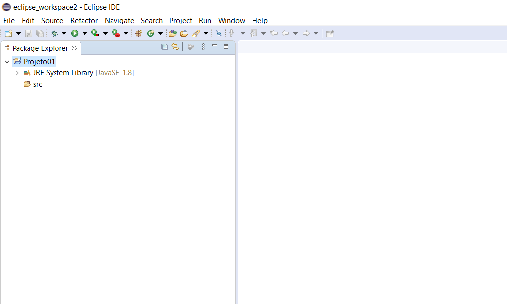
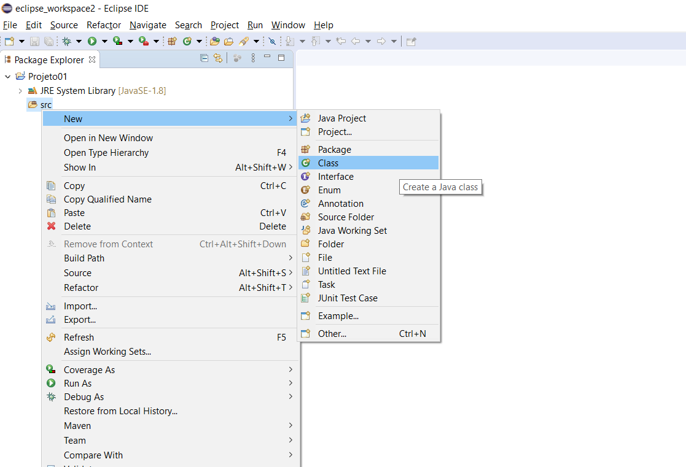
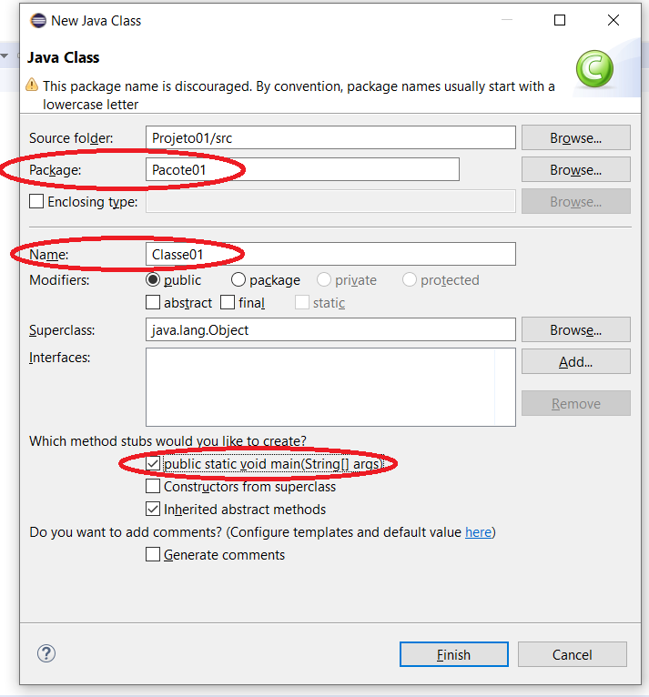
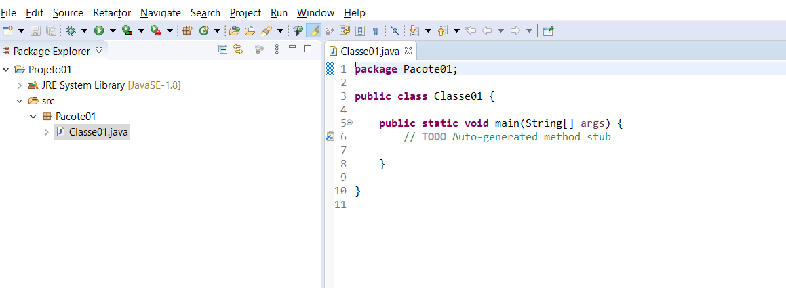
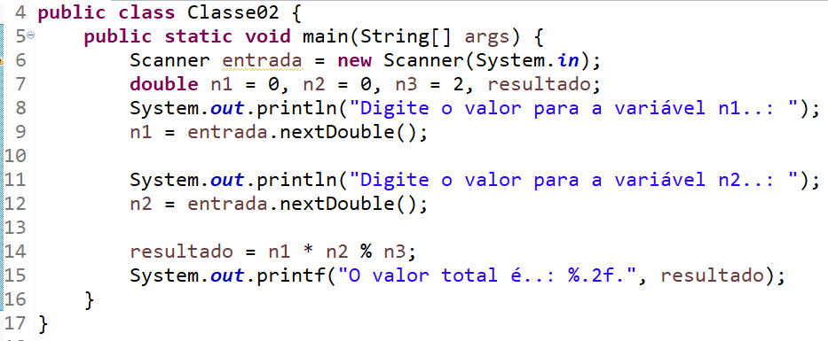
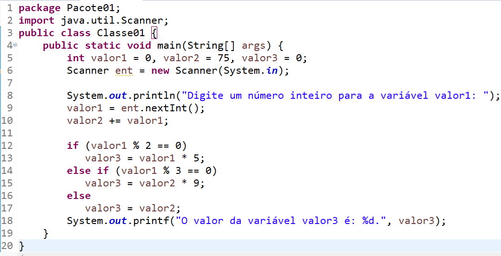
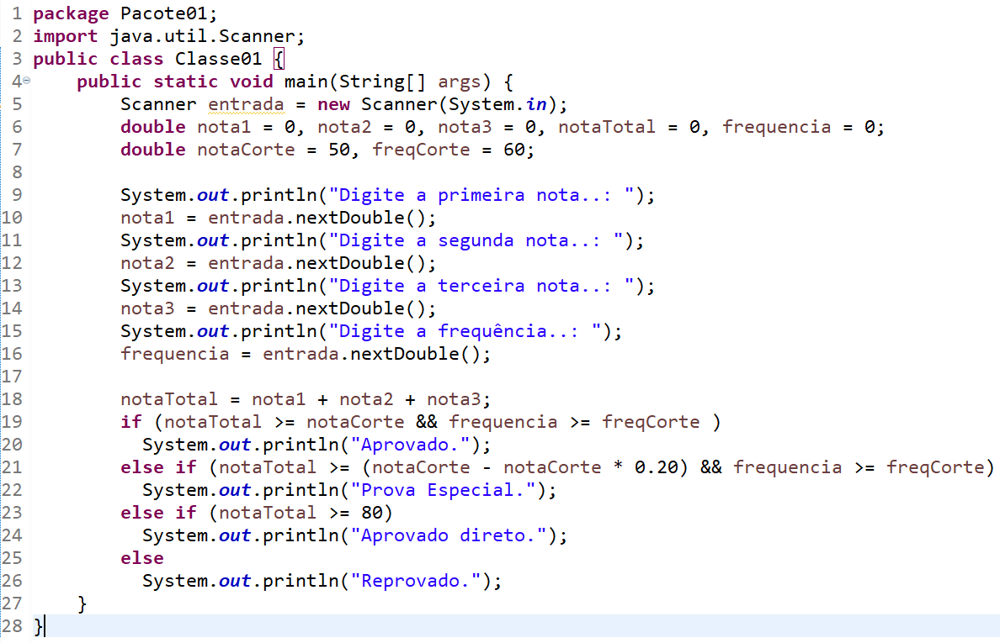

# 📃 Sobre

Trabalho Prático do **[Módulo 3: Fundamentos de Java](../)**.

Consiste na escrita e análise de três pequenos programas ([Classe01](src/Classe01.java) (Figura 06), [Classe02](src/Classe02.java) (Figura 07) e [Classe 03](src/Classe03.java) (Figura 08)) providenciados pelo professor.

## 👨‍🏫 Enunciado

> ### Objetivos
>
> Exercitar os seguintes conceitos trabalhados no Módulo:
>
> - Entrada e saída de dados.
> - Atribuição.
> - Tipos de dados primitivos.
> - Operadores aritméticos e lógicos.
> - Estruturas de seleção (condicionais).
>
> ### Atividades
>
> 1. Antes de iniciar o trabalho, o aluno deverá ter instalado o Eclipse em seu ambiente.
> 2. Acesse a IDE Eclipse e crie um novo projeto, conforme as figuras 01 e 02.
>
> |           Figura 01 - Criando um novo projeto.           |
> | :------------------------------------------------------: |
> |  |
>
> |  Figura 02 – Novo projeto criado com o nome Projeto01.   |
> | :------------------------------------------------------: |
> |  |
>
> 3. Inserir uma nova classe para o Projeto01.
>
> Para isso, **<u>selecione o diretório src</u>**, clique com o botão direito do mouse sobre ele e selecione a opção de menu New → Class.
>
> Na tela que abrirá, digite o nome do Package (Pacote01) e o nome da classe (Classe01). Não se esqueça de marcar a opção “*public static void main(String[] args)*”.
>
> Após informar os dados da classe, clique no botão Finish.
>
> As figuras 03 e 04 detalham esse passo.
>
> |          Figura 03 – Criando a classe principal          |
> | :------------------------------------------------------: |
> |  |
>
> |        Figura 04 – Dados para criação da classe.         |
> | :------------------------------------------------------: |
> |  |
>
> 4. Após a criação da classe, a sua tela deverá ter um formato parecido ao apresentado pela figura 05.
>
> | Figura 05 – Formato da tela após a criação da classe principal. |
> | :----------------------------------------------------------: |
> |      |
>
> 5. Digite o código apresentado na figura 06 na classe criada. O código está em formato de imagem, portanto não é possível copiar e colá-lo dentro da IDE. Você deverá digitá-lo, pois isso faz parte do processo de fixação do conteúdo.
>
> |              Figura 06 – Primeiro programa.              |
> | :------------------------------------------------------: |
> |  |
>
> 6. Abaixo temos mais 2 figuras com outros 2 programas.
>
> Você deverá seguir os passos 1 a 5 para cada um desses programas e implementá-los no Eclipse.
>
> Crie projetos e classes específicos para cada um dos programas. Você poderá usar a nomenclatura: ProjetoXX, PacoteXX e ClasseXX para cada um deles, onde XX será 02 e 03.
>
> |              Figura 07 – Segundo programa.               |
> | :------------------------------------------------------: |
> |  |
>
> |              Figura 08 – Terceiro programa.              |
> | :------------------------------------------------------: |
> |  |